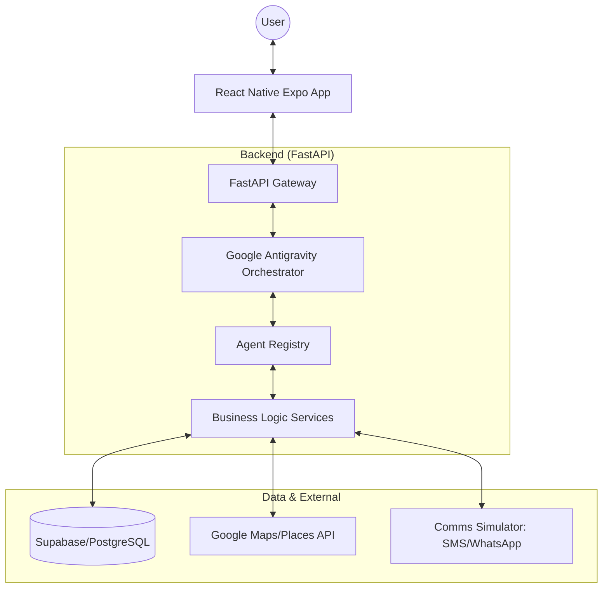

# System Architecture: Digital Mazdoor

## 1. High-Level Architecture

The system follows a **Modular Monolith** backend approach for simplicity in orchestration, with a decoupled mobile frontend.



## 2. Technology Stack

| Layer | Technology | Rationale |
| :--- | :--- | :--- |
| **Frontend** | React Native Expo | Cross-platform, fast development, strong ecosystem. |
| **Backend** | FastAPI | High performance, async support, native JSON handling. |
| **Orchestration** | Google Antigravity | Required primary orchestration engine for agentic workflows. |
| **Database** | Supabase (Postgres) | Real-time capabilities, easy Auth, managed hosting. |
| **Maps** | Google Maps API | Industry standard for geocoding and distance calculation. |

## 3. Data Flow

1. **Request**: User sends a natural language string via the Mobile App.
2. **Orchestration**: FastAPI triggers the Antigravity Orchestrator.
3. **Intent**: The `Intent Agent` parses the string into a structured JSON request.
4. **Context**: `Context Extraction Agent` enriches the request with user history and preferences.
5. **Matching & Ranking**: `Matching Agent` queries the DB; `Ranking Agent` scores the candidates.
6. **Scheduling**: `Scheduling Agent` verifies availability and proposes slots.
7. **Action**: `Booking Agent` updates the database and triggers the `Notification Agent`.
8. **Feedback**: The system returns the structured response + Reasoning Traces to the UI.

## 4. Reasoning Trace Implementation

Every agent call will wrap its result in a `TraceObject`:
```json
{
  "agent_id": "ranking_agent",
  "input": "{...}",
  "reasoning": [
    "Provider A is 2km away (+40 points)",
    "Provider A has a 4.9 rating (+30 points)",
    "Provider A matches budget constraints (+20 points)",
    "Total Score: 90"
  ],
  "decision": "Recommend Provider A",
  "confidence": 0.95
}
```

## 5. Security & Reliability

- **Authentication**: Supabase Auth for secure user/provider login.
- **Error Handling**: Graceful fallbacks for agent failures (e.g., if Matching Agent finds zero results, the system suggests alternative locations or times).
- **Concurrency**: Postgres row-level locking to prevent double bookings.
