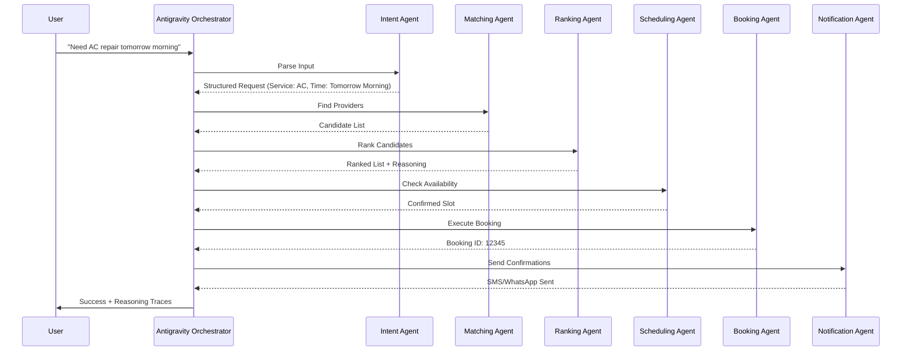

# Workflow Design: Digital Mazdoor

This document outlines the core agentic workflows that drive the Digital Mazdoor orchestration system.

## 1. Primary Service Request Workflow

This is the main flow triggered when a user makes a request.

## 2. Cancellation & Recovery Workflow

Triggered when a provider or user cancels a booking.

1. **Trigger**: Cancellation event received.
2. **Impact Analysis**: Reliability Agent updates provider/user score.
3. **Recovery**: 
    - If provider cancelled, Orchestrator triggers `Matching Agent` to find an immediate replacement.
    - `Scheduling Agent` confirms new slot.
    - `Notification Agent` alerts user of the change with reasoning (e.g., "Original provider had an emergency, found a replacement with similar rating").

## 3. Dispute Resolution Workflow

Triggered by a "Quality Complaint" or "No-Show" report.

1. **Evidence Collection**: Dispute Agent gathers logs (time of booking, GPS location of provider if available, communication logs).
2. **Reasoning**: 
    - "Provider marked as en-route but never arrived."
    - "User reported poor quality; provider has 2 previous similar complaints."
3. **Decision**:
    - Automatic refund simulation.
    - Provider penalty (Reputation score -10).
    - Suggestion of a "Certified Premium" provider for next time.

## 4. Reasoning Trace Standards

Every workflow step must contribute to the `trace_log`:

- **Step**: Provider Matching
- **Reasoning**: "Filtered 50 providers to 5 based on 'Gulshan' location and 'AC Repair' specialization."
- **Step**: Ranking
- **Reasoning**: "Selected Muhammad Ali as #1 due to his 98% reliability score despite being 1km further than others."
